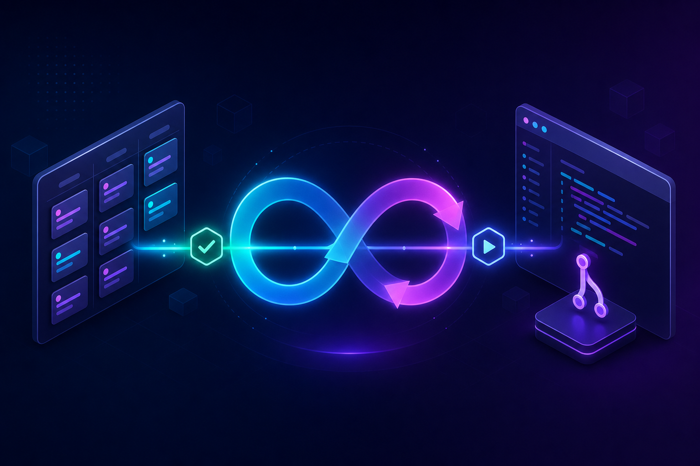

<p align="center">
  
</p>

<h1 align="center">ultraloop</h1>

<p align="center">
  <em>An autonomous software-engineering loop for Claude Code — split into two role-separated skills:<br>
  one plans and writes the board, the other reads the board and ships it.</em>
</p>

<p align="center">
  <code>/ultraloop:pm</code> &nbsp;·&nbsp; <code>/ultraloop:build</code>
</p>

---

## Why

Most "autonomous coding" setups collapse planning and execution into one all-powerful agent. That agent
can silently rewrite its own scope, skip tests, and leave a board that no longer reflects reality.

**ultraloop separates the two jobs and the two permission sets:**

| | `ultraloop:pm` — the planner | `ultraloop:build` — the engineer |
|---|---|---|
| **Owns** | scope, roadmap, the board | code, branches, merges |
| **Writes** | milestones, issues, acceptance criteria | source, tests, status + progress comments |
| **Cannot** | touch code (no `Write`/`Edit` tool) | define roadmap or change scope |
| **Tools** | `gh`, read-only `git`, search, ask | full toolchain (the loop needs it) |

The board (GitHub Projects v2) is the **single source of truth**. `pm` fills it; `build` drains it.
Neither can do the other's job — the separation is enforced at the tool-permission layer, not by trust.

## Core ideas

- **Two engines, faithfully reproduced** — `/loop` (self-pacing via `ScheduleWakeup`/`CronCreate`,
  waking on events with `Monitor`) and `/goal` (a Stop-hook gate that refuses to stop until the
  Definition of Done is met, with hard guards against runaway loops).
- **TDD-first** — every change starts from a failing test (Red → Green → Refactor).
- **E2E before merge** — `main` only receives code that passed a *real* production E2E run, captured
  as evidence and attached to the board card. Running ≠ correct.
- **Faithful board** — `build` moves each card through `In Progress → Done` and logs decisions,
  blockers, and results as it goes. Board/issue/PR/commit text is written in plain product language —
  it never names a tool, agent, or automation.
- **Hard safety rails** — per-repo state isolation, iteration/token/wall-clock budgets, a
  dead-man's-switch, a stall guard, fail-open hooks, and no recursive session spawning.

## Structure

```
ultraloop/
├── .claude-plugin/
│   ├── plugin.json          # registers both skills
│   └── marketplace.json     # this repo as a Claude Code marketplace
├── skills/
│   ├── pm/SKILL.md          # plan → write the board
│   └── build/SKILL.md       # read the board → TDD + E2E → ship
├── references/              # progressive-disclosure docs (loop, E2E, DoD, multi-repo, …)
├── scripts/                 # the engine: roadmap sync, board I/O, worktrees, cost guard, …
├── assets/                  # hooks (goal gate), CI workflows, templates
└── config.example.yaml      # per-repo config (copy to your target repo root)
```

## Quickstart

```bash
# 1. Add this repo as a marketplace and install the plugin
/plugin marketplace add kimimgo/ultraloop
/plugin install ultraloop@ultraloop

# 2. In your target repo, drop a config at the repo root
cp path/to/ultraloop/config.example.yaml ./ultraloop.config.yaml
#    edit `repo:` and the mission, leave the rest on `auto`

# 3. Plan — fills the board with milestones, cards, acceptance criteria
/ultraloop:pm

# 4. Build — reads the approved board and ships it, autonomously
/ultraloop:build
```

`pm` is a one-shot planning session (re-enter only when the roadmap changes). `build` self-paces with
`/loop` and gates its own stops with `/goal` until every card is Done *with evidence*.

> **Want to try without installing?** `claude --plugin-dir /path/to/ultraloop`

## Safety

ultraloop is designed to run unattended for hours, so every loop is bounded:

- **Budgets** — `max_loops`, `max_wall_clock_hours`, `max_tokens`; reaching any one stops the loop and
  reports *why it is unfinished* rather than churning.
- **Stall guard** — if the same blocker repeats N times with zero board progress, it escalates for a
  human instead of busy-looping.
- **Per-repo state** — loop counters, locks, and goal state are namespaced per repository, so
  concurrent loops never clobber each other.
- **HITL for production** — staging is autonomous; production deploys require a human approval gate.

## Configuration

Everything project-specific lives in one `ultraloop.config.yaml` at your target repo's root. Most
fields can stay empty/`auto` — the loop probes the environment and decides per project. See
[`config.example.yaml`](config.example.yaml) for the full, annotated schema (engine, board, budgets,
E2E, multi-repo).

## License

MIT
