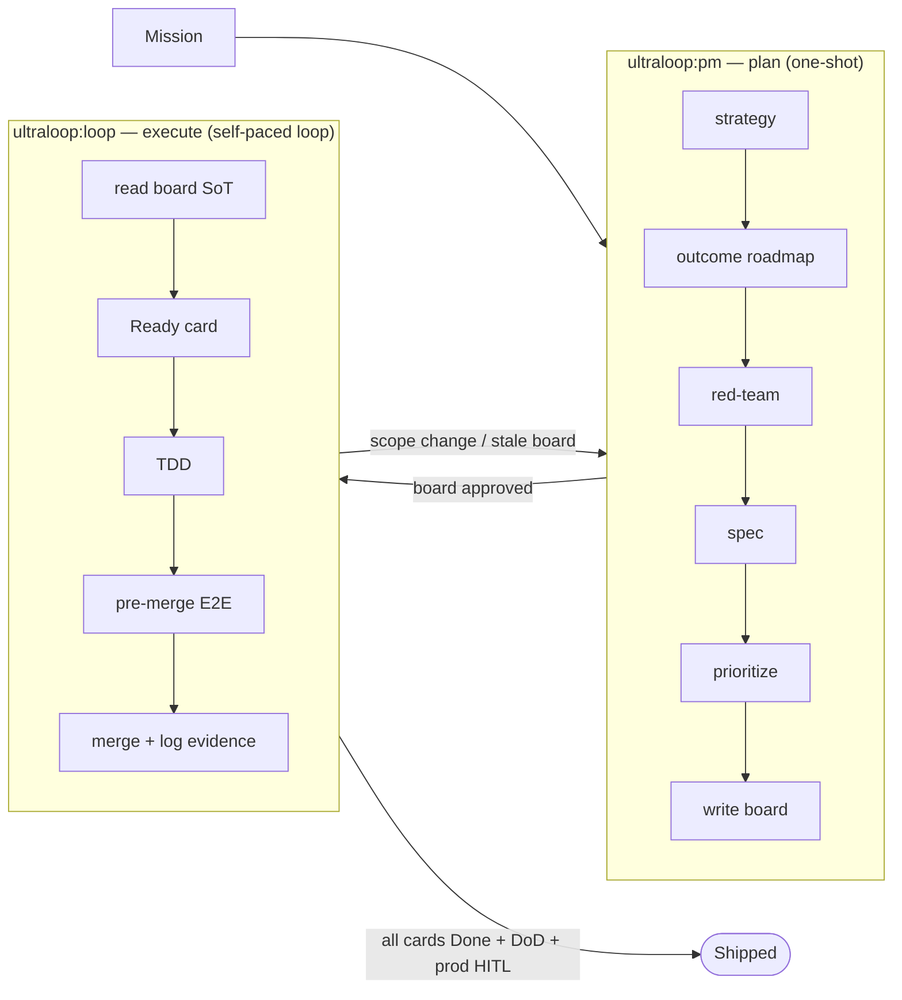
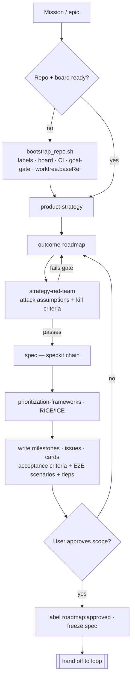
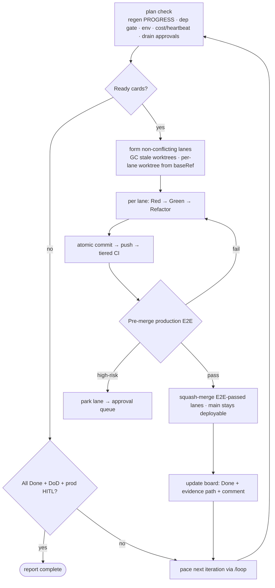

<p align="center">
  
</p>

<h1 align="center">ultraloop</h1>

<p align="center">
  <em>An autonomous software-engineering loop for Claude Code — split into two role-separated skills:<br>
  one plans and writes the board, the other reads the board and ships it.</em>
</p>

<p align="center">
  <em>ultraloop is an <strong>orchestrator</strong>: it doesn't reinvent the wheel — it calls proven skills
  (board, strategy, spec, TDD, review, ship) and stitches them into one faithful loop.</em>
</p>

<p align="center">
  <strong>v0.4.0</strong> &nbsp;·&nbsp; <code>/ultraloop:pm</code> &nbsp;·&nbsp; <code>/ultraloop:loop</code>
</p>

---

## Why

Most "autonomous coding" setups collapse planning and execution into one all-powerful agent. That agent
can silently rewrite its own scope, skip tests, and leave a board that no longer reflects reality.

**ultraloop separates the two jobs and the two permission sets:**

| | `ultraloop:pm` — the planner | `ultraloop:loop` — the engineer |
|---|---|---|
| **Owns** | scope, roadmap, the board | code, branches, merges |
| **Writes** | milestones, issues, acceptance criteria | source, tests, status + progress comments |
| **Cannot** | touch code (no `Write`/`Edit` tool) | define roadmap or change scope |
| **Tools** | `gh`, read-only `git`, search, ask | full toolchain (the loop needs it) |

The board (GitHub Projects v2) is the **single source of truth**. `pm` fills it; `loop` drains it.
Neither can do the other's job — the separation is enforced at the tool-permission layer, not by trust.

## Core ideas

- **Two engines, faithfully reproduced** — `/loop` (self-pacing via `ScheduleWakeup`/`CronCreate`,
  waking on events with `Monitor`) and `/goal` (a Stop-hook gate that refuses to stop until the
  Definition of Done is met, with hard guards against runaway loops).
- **TDD-first** — every change starts from a failing test (Red → Green → Refactor).
- **E2E before merge** — `main` only receives code that passed a *real* production E2E run, captured
  as evidence and attached to the board card. Running ≠ correct.
- **Faithful board** — `loop` moves each card through `In Progress → Done` and logs decisions,
  blockers, and results as it goes. Board/issue/PR/commit text is written in plain product language —
  it never names a tool, agent, or automation.
- **Hard safety rails** — per-repo state isolation, iteration/token/wall-clock budgets, a
  dead-man's-switch, a stall guard, fail-open hooks, and no recursive session spawning.

## Philosophy

1. **The board is the single source of truth.** Scope, priority, and progress live on the
   GitHub Projects board — never in side state. `pm` fills it; `loop` drains it.
2. **Separation of powers, enforced — not trusted.** `pm` owns *what & why* and has **no
   `Write`/`Edit` tool**; `loop` owns *how* and cannot define roadmap or scope. The wall is
   at the tool-permission layer.
3. **Plain product language.** Board / issue / PR / commit text never names a tool, agent, or
   automation. The history reads as human product work — portable and tool-agnostic.
4. **Outcome over output, red-teamed first.** The roadmap is framed as user/business outcomes,
   and its load-bearing assumptions are attacked (with kill criteria) before any spec is written.
5. **TDD is the unit of progress.** Every change starts from a failing test: Red → Green → Refactor.
6. **Merge is earned.** `main` only receives code that passed a *real* pre-merge production E2E,
   captured as evidence on the card. Running ≠ correct.
7. **Bounded autonomy.** `/loop` self-paces iterations; `/goal` gates stops. The stop-gate is
   **always fail-open** behind lock / budget / iteration-cap guards, so the loop can never run away.
8. **Isolated parallelism.** Build lanes run in separate git worktrees branched from a fixed
   base, so concurrent cards editing the same files never collide.

## Orchestrated skills

ultraloop doesn't reinvent the wheel — it **orchestrates** proven skills. Each phase calls a
specialist skill and falls back to a built-in path if that skill isn't installed.

| Skill | Role |
| --- | --- |
| **gh-roadmap** *(required)* | Board structure & setup authority — board, fields, views, Roadmap layout, built-in workflows, multi-repo. |
| product-strategy / outcome-roadmap / strategy-red-team / prioritization-frameworks | The PM chain — strategy, outcome framing, assumption red-teaming, prioritization. |
| speckit | Spec authoring. |
| tdd-workflow | Test-driven Red → Green → Refactor. |
| gan-* | Optional quality harnesses. |
| gstack-qa / gstack-review / gstack-investigate / gstack-ship | Verify, review, and deploy (encouraged). |

Call if present, fall back if absent. (details: `references/dependencies.md`)

## How the loop works

`pm` plans once and writes the board; `loop` reads the board and ships it, handing back to `pm`
only when scope must change.



### PM loop — plan → board



### Build loop — board → shipped



### The /goal stop-gate (safety)

Every stop attempt is re-checked. Guards run **before** the goal check and always allow the stop
(fail-open), so a stuck or runaway loop can never lock the session.


## Bootstrap

`pm` runs `bootstrap_repo.sh` **idempotently** on first use (and `loop` re-runs it if needed), so
you rarely call it by hand. It probes prerequisites then sets up, skipping anything already done:

- **Labels · board · templates** — sync labels, scaffold the Projects v2 board (falls back to
  Milestones + labels without a project-scope token), copy issue/PR/CI templates.
- **CI/CD · protection** — self-hosted runner check, `main` branch protection, staging (auto) +
  production (HITL) environments.
- **goal stop-gate** — install the fail-open Stop hook into the target repo's `.claude/settings.json`.
- **Workflow orchestration** — `config.workflow` records the model, effort, and `max_subagents`
  ultraloop uses when it fans work out to orchestrated skills.
- **Board via gh-roadmap golden template** — views, the Roadmap layout, and built-in workflows
  can't be created through the API, so `copyProjectV2` clones a golden template
  (`config.roadmap.template_node_id`) that already carries three role views
  (Roadmap — PM · schedule / Dev Board / Build Monitor) plus the added Horizon and Target Date fields.
- **★ Worktree optimization** — write `worktree.baseRef` into `.claude/settings.json` from
  `config.worktree.base_ref` (default **`fresh`**). This fixes where parallel build lanes branch:

  ```jsonc
  // target-repo/.claude/settings.json  (written by bootstrap)
  { "worktree": { "baseRef": "fresh" } }
  ```

  | value | lanes branch from | use when |
  |---|---|---|
  | **`fresh`** *(recommended)* | `origin/<default>` | reproducible lanes; unpushed local work never leaks between them |
  | `head` | local `HEAD` | a card must build on top of **unpushed** local commits |

  Lanes use `isolation: "worktree"` — each card gets its own worktree + branch, so concurrent
  edits can't conflict. Unchanged worktrees auto-clean; stale ones are pruned when their PR
  squash-merges (details: [`references/worktree-strategy.md`](references/worktree-strategy.md)).

## Structure

```
ultraloop/
├── .claude-plugin/
│   ├── plugin.json          # registers both skills
│   └── marketplace.json     # this repo as a Claude Code marketplace
├── skills/
│   ├── pm/SKILL.md          # plan → write the board
│   └── loop/SKILL.md        # read the board → TDD + E2E → ship
├── references/              # progressive-disclosure docs (loop, E2E, DoD, multi-repo, …)
├── scripts/                 # the engine: roadmap sync, board I/O, worktrees, cost guard, …
├── assets/                  # hooks (goal gate), CI workflows, templates
└── config.example.yaml      # per-repo config (copy to your target repo root)
```

## Quickstart

```bash
# 1. Add this repo as a marketplace and install the plugin
/plugin marketplace add kimimgo/ultraloop
/plugin install ultraloop@ultraloop

# 2. In your target repo, drop a config at the repo root
cp path/to/ultraloop/config.example.yaml ./ultraloop.config.yaml
#    edit `repo:` and the mission, leave the rest on `auto`

# 3. Plan — fills the board with milestones, cards, acceptance criteria
/ultraloop:pm

# 4. Loop — reads the approved board and ships it, autonomously
/ultraloop:loop
```

`pm` is a one-shot planning session (re-enter only when the roadmap changes). `loop` self-paces with
`/loop` and gates its own stops with `/goal` until every card is Done *with evidence*.

> **Want to try without installing?** `claude --plugin-dir /path/to/ultraloop`

## Safety

ultraloop is designed to run unattended for hours, so every loop is bounded:

- **Budgets** — `max_loops`, `max_wall_clock_hours`, `max_tokens`; reaching any one stops the loop and
  reports *why it is unfinished* rather than churning.
- **Stall guard** — if the same blocker repeats N times with zero board progress, it escalates for a
  human instead of busy-looping.
- **Per-repo state** — loop counters, locks, and goal state are namespaced per repository, so
  concurrent loops never clobber each other.
- **HITL for production** — staging is autonomous; production deploys require a human approval gate.

## Configuration

Everything project-specific lives in one `ultraloop.config.yaml` at your target repo's root. Most
fields can stay empty/`auto` — the loop probes the environment and decides per project. See
[`config.example.yaml`](config.example.yaml) for the full, annotated schema (engine, board, budgets,
E2E, multi-repo).

## License

MIT
