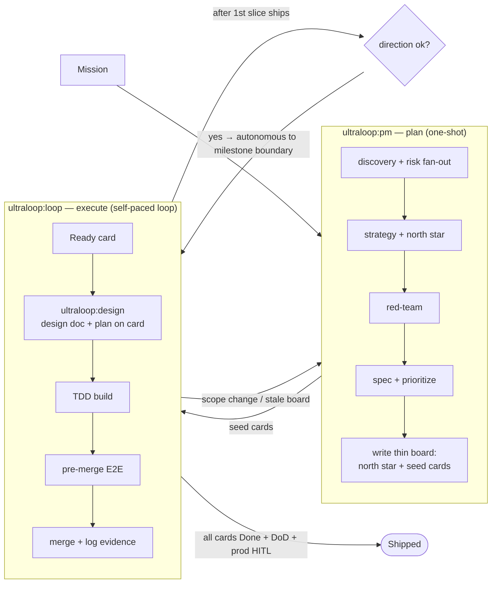
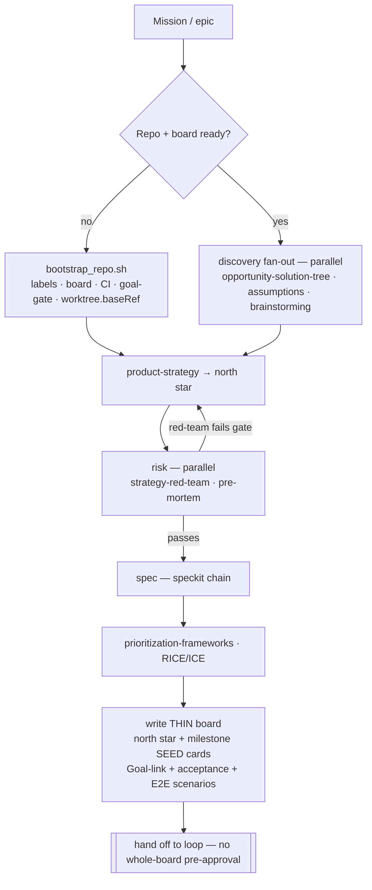
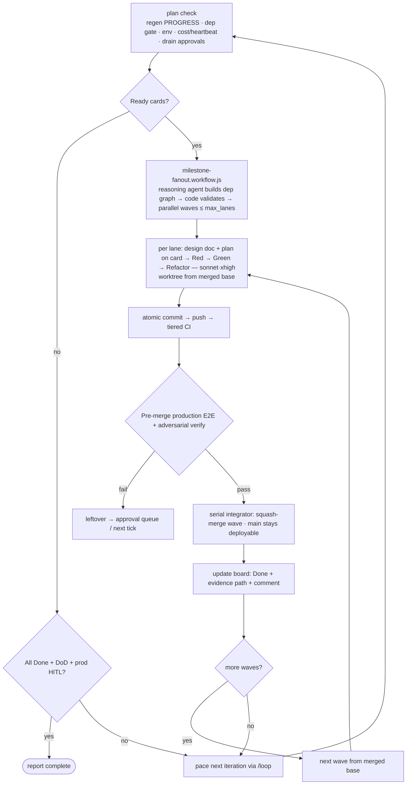
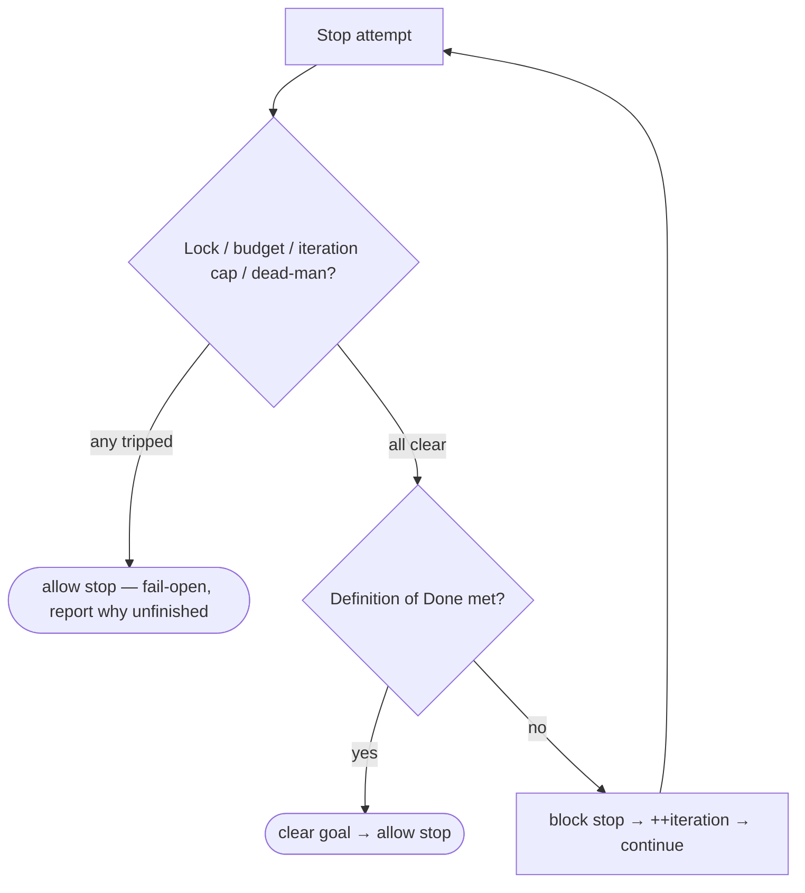

<p align="center">
  
</p>

<h1 align="center">ultraloop</h1>

<p align="center">
  <em>An autonomous software-engineering loop for Claude Code, built from exactly three mechanisms:<br>
  a <strong>GitHub Projects board</strong> as the single source of truth (WHAT),<br>
  <strong>dynamic multi-agent workflows</strong> designed per work item and codified into reusable scripts (HOW),<br>
  and a <strong>goal engine</strong> that self-paces and refuses to stop before Done (WHEN).</em>
</p>

<p align="center">
  <strong>v0.13.0</strong> &nbsp;·&nbsp; <code>/ultraloop:pm</code> &nbsp;·&nbsp; <code>/ultraloop:design</code> &nbsp;·&nbsp; <code>/ultraloop:loop</code>
</p>

---

## Why

Most "autonomous coding" setups collapse planning and execution into one all-powerful agent. That agent
can silently rewrite its own scope, skip tests, and leave a board that no longer reflects reality.

**ultraloop separates three jobs and three permission sets:**

| | `ultraloop:pm` — the planner | `ultraloop:design` — the designer | `ultraloop:loop` — the engineer |
|---|---|---|---|
| **Owns** | scope, roadmap, the board | one card's design + implementation plan | code, branches, merges |
| **Writes** | north star, milestones, **seed cards** | design doc + `## Implementation plan` on the card | source, tests, status + progress comments |
| **Cannot** | touch code, pre-decompose tactics, design | write source or merge | define roadmap or change scope |
| **When** | once, up front (human present) | per card, before the first test | autonomous, drains the board |

The board (GitHub Projects v2) is the **single source of truth**. `pm` fills it *thin* — a north star plus
seed cards, no tactical pre-decomposition. `loop` drains it, and for each card first invokes `design`
(design doc + plan on the card) and then builds. The separation is enforced at the tool-permission layer,
not by trust: `pm` has no `Write`/`Edit`, `design` never merges, `loop` never redefines scope.

Skill invocation is **explicit and verified** — the *1% rule*: each orchestrator calls its mapped sub-skills
by exact name; if a stage is even 1% relevant, it fires; it verifies the skill ran; and it fails loud rather
than silently degrading to a solo agent. So the plugin stays lean (only cherry-picked essentials are
bundled) while orchestration actually happens. And every card is a **container** — plan, design-doc link,
progress, and dual-recorded E2E evidence all live on the one card, so a card you open weeks later shows its
whole life. ([`references/skill-invocation.md`](references/skill-invocation.md) · [`references/card-container.md`](references/card-container.md))

## The trinity

```
board (gh Projects v2)  = WHAT to work on   — single source of truth (pm fills, loop drains)
dynamic workflow        = HOW to work on it — designed per card, codified when it recurs
goal (/loop + /goal)    = WHEN to stop      — self-pacing + a stop-gate that re-checks the DoD
```

- **Dynamic workflow ★** — the loop doesn't run one fixed pipeline. For each work item it *designs* an
  orchestration (shape → dependencies → uncertainty → casting → budget), executes it with the Claude Code
  Workflow tool, and **codifies recurring shapes into reusable scripts** (`workflows/*.workflow.js`,
  parameterized by `args`, resumable). Casting is code, not convention: **coding agents run sonnet·xhigh;
  reasoning and verification stages inherit the main session** (run it on your strongest model).
  Methodology: [`references/dynamic-workflow-design.md`](references/dynamic-workflow-design.md).
- **Goal engine** — `/loop` (self-pacing via `ScheduleWakeup`/`CronCreate`, waking on events with `Monitor`)
  plus `/goal` (a Stop-hook gate that refuses to stop until the Definition of Done is met), with hard guards
  against runaway loops. [`references/engine-loop-and-goal.md`](references/engine-loop-and-goal.md).
- **Board = SoT, every card a container** — each card carries a `Goal-link:` to a milestone goal (which
  chains to one north star), a `Design-Doc` link to its published design, an on-card `## Implementation plan`,
  progress comments, and dual-recorded E2E evidence. `loop` moves each card `In Progress → Done` and logs as
  it goes, so the card shows its whole life. One board may span N repos (a gh-roadmap multi-repo link);
  ultraloop stays single-repo — each repo runs its own session on its assigned slice (`board.shared: true`).

## Philosophy

1. **The board is the single source of truth.** Scope, priority, and progress live on the
   GitHub Projects board — never in side state. `pm` fills it; `loop` drains it.
2. **Separation of powers, enforced — not trusted.** `pm` owns *what & why* (thin: north star + seed cards,
   **no `Write`/`Edit`**, no design, no tactical decomposition); `design` owns *how* per card (design doc +
   plan, never merges); `loop` owns the build and cannot define roadmap or scope.
2b. **Explicit invocation, loud fallback (the 1% rule).** Orchestrators call sub-skills by exact name, fire
   on 1% relevance, verify the call ran, and state any fallback — never a silent degrade to a solo agent.
3. **Workflows are designed, then codified.** Improvise a shape once; the second time it recurs,
   it becomes a script with an `args` contract. The methodology compounds instead of evaporating.
4. **Casting is code.** Model×effort per stage type lives in config and script defaults —
   coding = sonnet·xhigh, reasoning/verification = the main session — not in anyone's memory.
5. **Plain product language.** Board / issue / PR / commit text never names a tool, agent, or
   automation. The history reads as human product work — portable and tool-agnostic.
6. **Outcome over output, red-teamed first.** The roadmap is framed as user/business outcomes,
   and its load-bearing assumptions are attacked (with kill criteria) before any spec is written.
7. **TDD is the unit of progress; merge is earned.** Every change starts from a failing test, and
   `main` only receives code that passed a *real* pre-merge production E2E with captured evidence.
8. **Bounded autonomy.** `/loop` self-paces; `/goal` gates stops. The stop-gate is **always
   fail-open** behind lock / budget / iteration-cap guards, so the loop can never run away.
9. **Isolated parallelism.** Build lanes run in separate git worktrees branched from a fixed
   base, so concurrent cards editing the same files never collide.

## Dynamic workflow — the shipped library

Reusable orchestration scripts, invoked as
`Workflow({scriptPath: "${CLAUDE_PLUGIN_ROOT}/workflows/<name>.workflow.js", args: {...}})`.
Each is also a reference implementation of the design methodology.

| Script | Shape | Casting |
|---|---|---|
| `milestone-fanout` ★ | **one invocation = one milestone**: a reasoning agent builds the card dependency graph, code validates + schedules parallel waves, lanes execute, a serial integrator merges verified lanes wave by wave until the milestone drains | graph inherits main · lanes **sonnet·xhigh** · verifiers inherit main |
| `lane-fanout` | one card-batch → worktree-isolated TDD lanes → per-lane adversarial verify (no merge) | lanes **sonnet·xhigh** · verifiers inherit main |
| `pm-chain` | strategy perspectives → north star → **red-team barrier** → spec per milestone → prioritized plan | all reasoning — inherits main |
| `adversarial-verify` | claims × diverse lenses → refuters → majority verdict | verification — inherits main |

The fan-out **envelope is the milestone** — the largest scope whose design can be trusted (its contract is
red-teamed and human-approved at the pm gate, and it has a machine drain condition + verdict question).
Epic/board scope is never one invocation; cards are the small-run fallback.

Project-specific shapes the loop codifies land in the target repo's `.claude/workflows/`, named and
committed like any other engineering asset. Design procedure, pattern vocabulary (pipeline / barrier /
judge panel / loop-until-dry / …), casting policy, and the codification rule:
[`references/dynamic-workflow-design.md`](references/dynamic-workflow-design.md).

## Orchestrated skills

ultraloop doesn't reinvent the wheel — it **orchestrates** proven skills. Each phase calls a
specialist skill and falls back to a built-in path if that skill isn't installed.

| Skill | Role |
| --- | --- |
| **gh-roadmap** *(bundled)* | Shared board-I/O sub-skill — board, fields, views, Roadmap layout, multi-repo links. `pm` calls it to write the board, `loop` to move cards. Ships inside this plugin (`skills/gh-roadmap/`). |
| **imgyu-techdoc** *(bundled)* | Single-file HTML design-doc house style. `design` authors each card's design doc with it, then publishes to an artifact host and links it from the card's `Design-Doc` field. |
| **The insight layer** *(bundled, cherry-picked)* | `opportunity-solution-tree` · `identify-assumptions` → `prioritize-assumptions` · `brainstorming` · `pre-mortem` — `pm`'s discovery/risk fan-out, so it delivers a point of view, not just cards. |
| product-strategy / outcome-roadmap / strategy-red-team / prioritization-frameworks / speckit | The strategy chain — strategy, outcome framing, assumption red-teaming (the barrier), prioritization, spec authoring. |
| tdd-workflow / superpowers | Test-driven Red → Green → Refactor in the build lanes. |
| **gstack lane** *(entirely optional)* | If the [gstack](https://github.com/gstackio) skill suite is installed, ultraloop calls it at mapped steps — investigate/qa-only/review in the loop, health/retro at milestone close, canary post-deploy. Every entry degrades to a built-in path; **merge/deploy authority never leaves ultraloop**. No gstack? Nothing breaks. |

**The 1% rule** governs every call: fire the mapped skill if it is even 1% relevant, verify it ran, and fall
back **loudly, never silently**. Bundled skills are always present; referenced ones fall back to a built-in
path that is stated, not hidden. (full map: [`references/skill-invocation.md`](references/skill-invocation.md)
· [`references/dependencies.md`](references/dependencies.md))

## How the loop works

`pm` plans once and writes a thin board; `loop` drains it, and for each card first invokes `design`
(design doc + plan on the card) and then builds — handing back to `pm` only when scope must change.



### PM loop — plan → board



`pm` writes a **thin** board — a north star and seed cards, not a pile of pre-decomposed tactical cards.
There is no whole-board approval gate up front; the human checks direction once, later, after the first
slice actually ships (see the build loop).

### Build loop — board → shipped



### The /goal stop-gate (safety)

Every stop attempt is re-checked. Guards run **before** the goal check and always allow the stop
(fail-open), so a stuck or runaway loop can never lock the session.



## Bootstrap

`pm` runs `bootstrap_repo.sh` **idempotently** on first use (and `loop` re-runs it if needed), so
you rarely call it by hand. It probes prerequisites then sets up, skipping anything already done:

- **Labels · board · templates** — sync labels, scaffold the Projects v2 board (falls back to
  Milestones + labels without a project-scope token), copy issue/PR/CI templates.
- **CI/CD · protection** — self-hosted runner check, `main` branch protection, staging (auto) +
  production (HITL) environments.
- **goal stop-gate (forced)** — install the fail-open Stop hook into the target repo's
  `.claude/settings.json` **unconditionally** (v0.13: `install_stop_hook` is not an off switch).
- **Dynamic-workflow casting** — record the casting policy (coding model/effort + `max_subagents`)
  into `.claude/settings.json` as the default for fanned-out subagents.
- **Board via gh-roadmap golden template** — views and the Roadmap layout can't be created through the
  API, so `copyProjectV2` clones a golden template (`config.roadmap.template_node_id`) that already carries
  four role views (**Roadmap — PM · schedule / Dev Board / Build Monitor (by Wave) / Card Audit**) plus the
  card-container fields: `Design-Doc`, `Stage` (Planning/Designing/Building), `Wave`, Horizon, Target Date.
- **★ Worktree optimization** — write `worktree.baseRef` into `.claude/settings.json` from
  `config.worktree.base_ref` (default **`fresh`**). This fixes where parallel build lanes branch:

  | value | lanes branch from | use when |
  |---|---|---|
  | **`fresh`** *(recommended)* | `origin/<default>` | reproducible lanes; unpushed local work never leaks between them |
  | `head` | local `HEAD` | a card must build on top of **unpushed** local commits |

  Lanes use `isolation: "worktree"` — each card gets its own worktree + branch, so concurrent
  edits can't conflict. Unchanged worktrees auto-clean; stale ones are pruned when their PR
  squash-merges (details: [`references/worktree-strategy.md`](references/worktree-strategy.md)).

## Structure

```
ultraloop/
├── .claude-plugin/
│   ├── plugin.json          # registers the skills
│   └── marketplace.json     # this repo as a Claude Code marketplace
├── skills/
│   ├── pm/SKILL.md          # plan thin (north star + seed cards) → write the board — no code
│   ├── design/SKILL.md      # per card: design doc (imgyu-techdoc) + implementation plan → attach to card
│   ├── loop/SKILL.md        # drain the board → design per card → TDD + E2E → ship
│   ├── gh-roadmap/          # bundled board authority (Projects v2 structure & setup)
│   ├── imgyu-techdoc/       # bundled single-file HTML design-doc house style
│   └── …                    # bundled insight layer: opportunity-solution-tree, {identify,prioritize}-assumptions, brainstorming, pre-mortem
├── workflows/               # ★ reusable dynamic-workflow scripts (milestone-fanout · lane-fanout · pm-chain · adversarial-verify)
├── references/              # progressive-disclosure docs (dynamic-workflow-design, engine, E2E, DoD, …)
├── scripts/                 # the engine: roadmap sync, board I/O, worktrees, cost guard, goal gate, …
├── assets/                  # hooks (goal gate), CI workflows, templates
└── config.example.yaml      # per-repo config (copy to your target repo root)
```

## Prerequisites

Installing the plugin takes a minute; a *complete* loop needs three pieces of GitHub
infrastructure. Each is checked loudly at bootstrap — nothing fails silently:

| What | Why | Cost |
|---|---|---|
| **Project-scope token** — a PAT (classic) with `project` scope, exported as `UE_PROJECT_TOKEN` | the default `GITHUB_TOKEN` cannot write GitHub Projects v2 boards | 2 min — <https://github.com/settings/tokens> → `project` scope |
| **Self-hosted runner** on the target repo | CI gates assume a runner you control (hosted-runner minutes burn fast in an overnight loop) | ~15 min — <https://docs.github.com/en/actions/hosting-your-own-runners> |
| **Golden template board** *(optional)* | views and the Roadmap layout cannot be created via API — a copied template is the only automation | ~20 min once, reused forever; carries the four role views + card-container fields (`Design-Doc`/`Stage`/`Wave`). Skip it and you get a functional fresh board without the Roadmap views (`skills/gh-roadmap/references/golden-template-setup.md`) |

Discord notifications are optional (console fallback); approvals are a file queue answered from any
shell — zero extra infrastructure.

## Quickstart

```bash
# 1. Add this repo as a marketplace and install the plugin
/plugin marketplace add kimimgo/ultraloop
/plugin install ultraloop@ultraloop

# 2. In your target repo, drop a config at the repo root
#    (or just let /ultraloop:pm seed it — bootstrap copies the example on first run)
cp ~/.claude/plugins/cache/ultraloop/ultraloop/*/config.example.yaml ./ultraloop.config.yaml 2>/dev/null \
  || echo "skip — /ultraloop:pm will seed it"
#    edit `repo:` and the mission, leave the rest on `auto`

# 3. Plan — north star first, then milestones with seed cards (each with a goal-link
#    line + acceptance criteria). Thin board, no tactical pre-decomposition.
/ultraloop:pm

# 4. Loop — drains the board autonomously; per card it invokes design (design doc +
#    plan), then TDD-builds. You approve direction ONCE, after the first slice ships.
/ultraloop:loop
```

`pm` is a one-shot planning session (re-enter only when the roadmap changes). Instead of a whole-board
pre-approval, `loop` ships the first vertical card, asks *"direction ok?"* once, then runs autonomously to
the milestone boundary. It self-paces with `/loop` and gates its own stops with `/goal` (forced) until every
card is Done *with evidence*. `/ultraloop:design` also runs standalone if you want to design a single card.

> **Want to try without installing?** `claude --plugin-dir /path/to/ultraloop`

## Safety

ultraloop is designed to run unattended for hours, so every loop is bounded:

- **Budgets** — `max_loops` and `max_wall_clock_hours` are enforced deterministically; reaching one
  stops the loop and reports *why it is unfinished* rather than churning. A completed run resets
  its counters automatically; starting a fresh run after a budget-stop uses `cost_guard.sh --reset`.
- **Run scope** — `engine.goal.scope: "milestone:<title>"` makes a run end when THAT milestone is
  drained instead of the whole board: the goal gate counts only its issues, the loop is handed only
  its Ready cards, and the deploy marker is per-milestone. Default `"board"` keeps classic semantics.
- **Stall guard** — if the same blocker repeats N times with zero board progress, it escalates for a
  human instead of busy-looping.
- **Bounded fan-out** — workflow concurrency ≤ `workflow.max_subagents`; loop-shaped patterns carry
  dry-out caps in code; nothing inside a workflow spawns sessions.
- **Per-repo state** — loop counters, locks, and goal state are namespaced per repository, so
  concurrent loops never clobber each other.
- **HITL for production** — staging is autonomous; production deploys require a human approval gate.

## Configuration

Everything project-specific lives in one `ultraloop.config.yaml` at your target repo's root. Most
fields can stay empty/`auto` — the loop probes the environment and decides per project. See
[`config.example.yaml`](config.example.yaml) for the full, annotated schema (engine, board, budgets,
E2E, workflow casting).

## License

MIT
